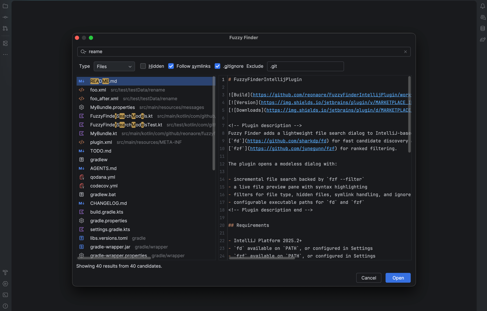

# FuzzyFinderIntellijPlugin


[](https://plugins.jetbrains.com/plugin/31449-fuzzy-finder)
[](https://plugins.jetbrains.com/plugin/31449-fuzzy-finder)

<!-- Plugin description -->
Fuzzy Finder adds a lightweight file search dialog to IntelliJ-based IDEs by combining
[`fd`](https://github.com/sharkdp/fd) for fast candidate discovery and
[`fzf`](https://github.com/junegunn/fzf) for ranked filtering.

The plugin opens a modeless dialog with:

- incremental file search backed by `fzf --filter`
- a live file preview pane with syntax highlighting
- filters for file type, hidden files, symlink handling, and ignore rules
- configurable executable paths for `fd` and `fzf`
- project-root aware search scoped to IntelliJ content roots


<!-- Plugin description end -->

## Requirements

- IntelliJ IDEA 2026.1 or newer
- `fd` available on `PATH`, or configured in Settings
- `fzf` available on `PATH`, or configured in Settings

## Getting Started

Fuzzy Finder depends on the external `fd` and `fzf` commands. The plugin does not bundle
these executables, so install them before using the plugin.

### 1. Install `fd` and `fzf`

On macOS with Homebrew:

```shell
brew install fd fzf
```

On other platforms, follow the official installation guides:

- [`fd` installation](https://github.com/sharkdp/fd#installation)
- [`fzf` installation](https://github.com/junegunn/fzf#installation)

### 2. Check the executable paths

Make sure both commands are available from your shell:

```shell
which fd
which fzf
```

If both commands return paths, the plugin can usually use them without additional configuration.

### 3. Configure paths in the IDE if needed

If IntelliJ IDEA cannot find `fd` or `fzf`, configure the executable paths manually:

1. Open `Settings/Preferences | Tools | Fuzzy Finder`.
2. Set the `fd executable path`.
3. Set the `fzf executable path`.
4. Apply the changes.

For example, Homebrew installations may use paths such as:

```text
/opt/homebrew/bin/fd
/opt/homebrew/bin/fzf
```

Leave the fields blank to use `fd` and `fzf` from `PATH`.

### 4. Open Fuzzy Finder

Open `Tools | Open Fuzzy Finder`, type a query, and press `Enter` to open the selected file.

## Usage

Open `Tools | Open Fuzzy Finder`, type a query, then press `Enter` to open the selected file.

The dialog supports:

- `Ctrl+N` to move to the next result
- `Ctrl+P` to move to the previous result
- double-click or `Enter` to open the selected file

Executable paths can be configured in `Settings | Tools | Fuzzy Finder`.

## Feature Overview

- Find project files quickly with `fd` and rank matches with `fzf --filter`
- Preview the current selection without leaving the dialog
- Narrow results with hidden-file, symlink, ignore-rule, and entry-type options
- Point the plugin to custom `fd` and `fzf` executables when they are not on `PATH`
- Search only within the current project's IntelliJ content roots

The initial public release is intended for local projects that already use `fd` and `fzf`.
The plugin does not bundle either executable and expects them to be installed separately.

## Installation

- Using the IDE built-in plugin system:

  <kbd>Settings/Preferences</kbd> > <kbd>Plugins</kbd> > <kbd>Marketplace</kbd> > <kbd>Search for "Fuzzy Finder"</kbd> >
  <kbd>Install</kbd>

- Using JetBrains Marketplace:

  Go to [JetBrains Marketplace](https://plugins.jetbrains.com/plugin/MARKETPLACE_ID) and install it by clicking
  the <kbd>Install to ...</kbd> button in case your IDE is running.

  You can also download the [latest release](https://plugins.jetbrains.com/plugin/MARKETPLACE_ID/versions) from
  JetBrains Marketplace and install it manually using
  <kbd>Settings/Preferences</kbd> > <kbd>Plugins</kbd> > <kbd>⚙️</kbd> > <kbd>Install plugin from disk...</kbd>

- Manually:

  Download the [latest release](https://github.com/reonaore/FuzzyFinderIntellijPlugin/releases/latest) and install it
  manually using
  <kbd>Settings/Preferences</kbd> > <kbd>Plugins</kbd> > <kbd>⚙️</kbd> > <kbd>Install plugin from disk...</kbd>
